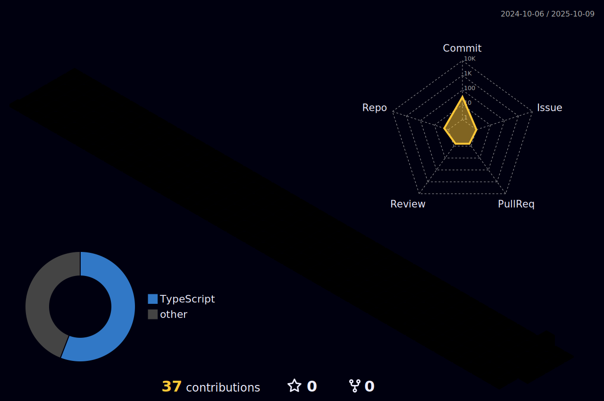

<!-- Animated Typing Header -->
<h1 align="center">
  
</h1>

<!-- 🚀 Hero Animation (Pill Shape) -->
<p align="center">
  
</p>


---

## 🌌 About Me
I am a **future-driven technologist** passionate about blending **artificial intelligence**, **scalable architecture**, and **immersive user experiences**.  
From building high-performance backends to crafting sleek frontends, I thrive on **transforming ambitious ideas into reality**.  
My philosophy: **"Innovate boldly, automate smartly, and code elegantly."**

### ⚡ Quick Dev Snapshot
```python
class AvixWz:
    def __init__(self):
        self.core_values = [
            "Simplicity is power ⚡",
            "Code speaks louder than words 💻",
            "Fail fast, learn faster 🚀"
        ]
        self.tech_stack = {
            "Languages": ["HTML5 🧱", "CSS3 🎨", "JavaScript ✨", "Python 🐍"],
            "Frameworks": ["Node.js 🌳", "React ⚛️", "Express ⚡"],
            "Databases": ["MongoDB 🍃", "Firebase 🔥"],
            "Tools": ["Git 🧬", "VS Code 🧠", "Docker 🐳"]
        }
        self.mantra = "Build. Break. Fix. Repeat."

    def innovate(self, idea):
        return f"Turning {idea} into production-ready magic ✨"

    def connect(self):
        return "Collaboration fuels innovation 💡"
```

---

## 🧠 Tech Frontier I'm Exploring
Currently delving into the **future of tech** with projects involving:

- 🤖 **Artificial Intelligence & Machine Learning**  
- 🌐 **Next.js & Modern Frontend Frameworks**  
- ☁️ **Cloud-Native Architectures (AWS, GCP)**  
- 🔒 **Cybersecurity & Ethical Hacking**

<p align="center">
  
  
  
  
  
  
  
  
</p>

---

## 🛠️ Advanced Toolbox
<p align="center">
  
</p>

---

## 📊 GitHub Analytics & Insights
An ever-evolving look at my **contributions, growth, and languages**:

<p align="center">
  
  
  
</p>

---

## 🌈 3D Contribution Graph
<p align="center">
  
</p>

<!-- Activity Graph -->
<p align="center">
  
</p>

<!-- Visitor Counter -->
<p align="center">
  
</p>

---

<details>
<summary>🎯 Fun Zone (Click to Expand)</summary>

- 🎶 **Coding Playlist:** Synthwave & Chill Beats 🎧  
- 🕹️ **Hobby:** Creating indie web games no one asked for  
- 💡 **Motto:** “Dream in code, deploy with confidence.”
</details>

---

## 🌐 Let's Connect & Build the Future
Open to **collaborations, open-source contributions, and cutting-edge projects**.  
Let’s connect and shape the next era of technology together!

<p align="center">
  <a href="mailto:youremail@example.com"></a>
  <a href="https://www.linkedin.com/in/yourprofile/"></a>
  <a href="https://github.com/AvixWz"></a>
  <a href="https://twitter.com/yourhandle"></a>
  <a href="https://yourwebsite.com"></a>
</p>

---

<p align="center">
  
</p>
